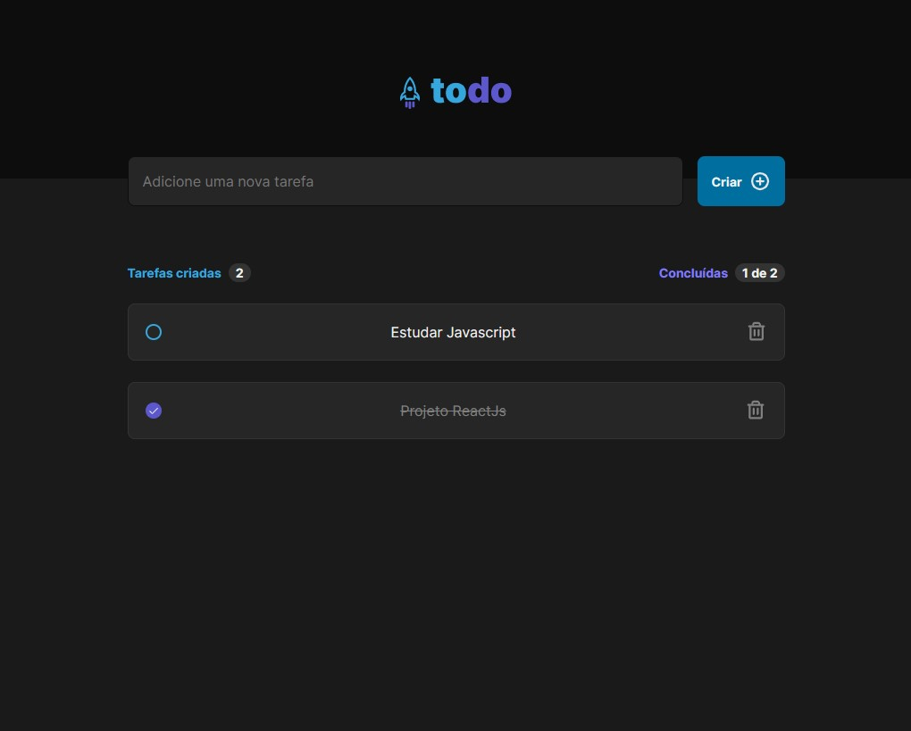

# <h1 align="center">Todo List</h1>

An Todo List App

  <a href="#-Project">Project</a>&nbsp;&nbsp;&nbsp;|&nbsp;&nbsp;&nbsp;
  <a href="#-Funcionalities">Funcionalities</a>&nbsp;&nbsp;&nbsp;|&nbsp;&nbsp;&nbsp;
  <a href="#-Technologies">Technologies</a>&nbsp;&nbsp;&nbsp;|&nbsp;&nbsp;&nbsp;
  <a href="#-License">License</a>

  

## 📁 Project

A Todo List app with Typescript.

# ✔ Funcionalities

- Add task
- Delete task
- Check/uncheck task

## 🚀 Technologies

- ReactJS
- TypeScript

## 📝 License

  

 
